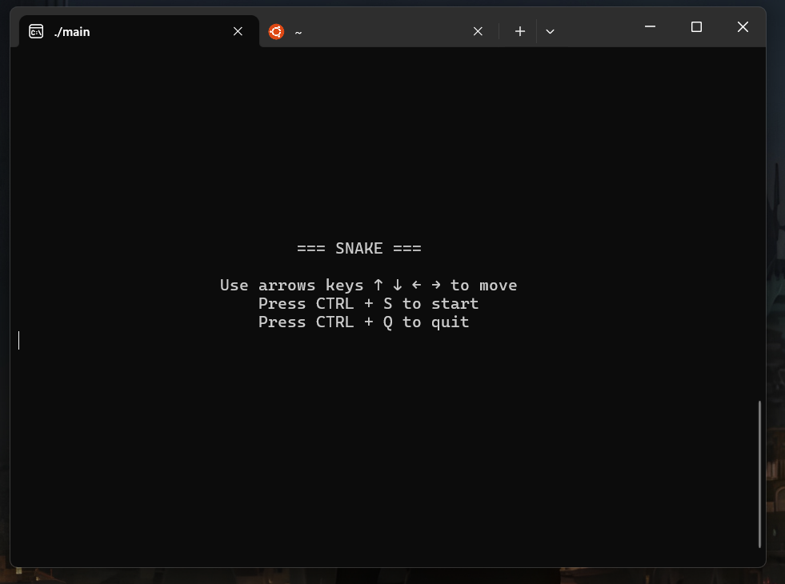
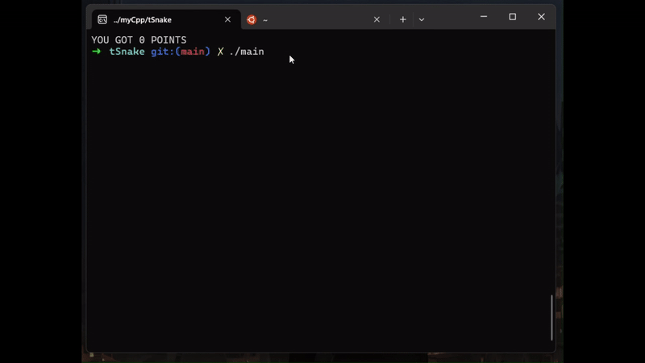

# 🐍 Snake Game (Terminal Version)

##  📖 Description
tSnake is a terminal-based implementation of the classic **Snake Game**.

---

## 💻 Features

- **Raw Mode Terminal Input**: Utilizes raw mode to handle real-time keyboard inputs without displaying typed characters.
- **Game Controls**:
  - **Arrow Keys**: Control the direction of the snake.
  - **CTRL+S**: Start the game.
  - **CTRL+Q**: Exit the game.
- **Dynamic Gameplay**:
  - Snake grows when eating apples.
  - The game ends when the snake collides with the wall or itself.
- **Score Tracking**: Displays the player's score upon game over.
- **Responsive Design**: Automatically adapts to the size of your terminal.

---

## How to Build and Run 🚀

### 📄 Prerequisites
- A C++17-compatible compiler (e.g., GCC, Clang).
- **Make** (optional, for build automation).

### 🦵 Steps
1. Clone this repository:
   ```bash
   git clone https://github.com/thom151/tSnake
   cd tSnake
   ```
2. Build the project using `make`:
   ```bash
   make
   ```
   Alternatively, compile manually:
   ```bash
   g++ -Wall -Wextra -std=c++17 -o main main.cpp terminal.cpp snake.cpp apple.cpp
   ```
3. Run the game:
   ```bash
   ./main
   ```

---

## 🎮 Game Controls

- **Arrow Keys** (`↑`, `↓`, `←`, `→`): Move the snake.
- **CTRL+S**: Start the game.
- **CTRL+Q**: Quit the game.

---

## 🎥 Example Output

**Start Screen:**


**Gameplay Example:**


---


## ✍️ Contributing

1. **Bug Reports**: If you encounter a bug, please create an issue with detailed steps to reproduce it.
2. **Feature Requests**: Suggest new features or improvements by opening an issue.
3. **Code Contributions**:
   - Fork the repository.
   - Create a new branch for your feature or bugfix.
   - Commit your changes and open a pull request.
4. **Documentation**: Help improve this `README` or add additional documentation.
5. **Feedback**: Share your thoughts or suggestions to enhance the game.


### Submit a pull request

If you'd like to contribute, please fork the repository and open a pull request to the `master` branch.

## 🤝 Need Help?

If you encounter any issues or have questions:
- Open an issue in this repository.
- Contact me at [thomassantos2003@gmail.com](mailto:thomassantos2003@gmail.com)

## 🙏 Acknowledgments

- This project was inspired by and references concepts from the [Kilo Text Editor Tutorial](https://viewsourcecode.org/snaptoken/kilo/). Special thanks to the authors for their detailed and insightful explanations that helped in understanding terminal manipulation and raw input mode in C.
- Inspired by the classic Snake game.
- Special thanks to the open-source community for their invaluable resources on terminal programming.

## License

This project is licensed under the MIT License. Feel free to use, modify, and distribute it as you wish.

---

Enjoy playing **Snake**! 🎉
